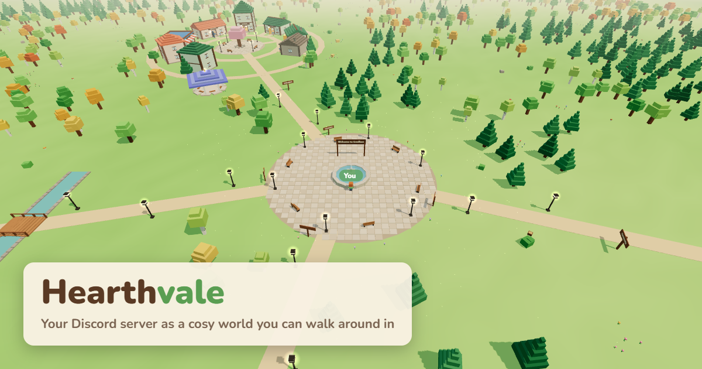
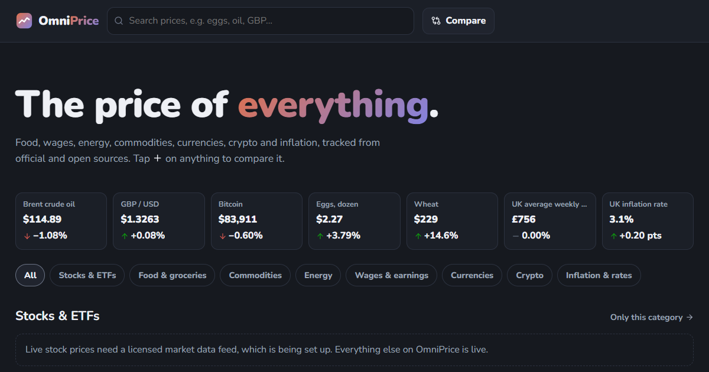
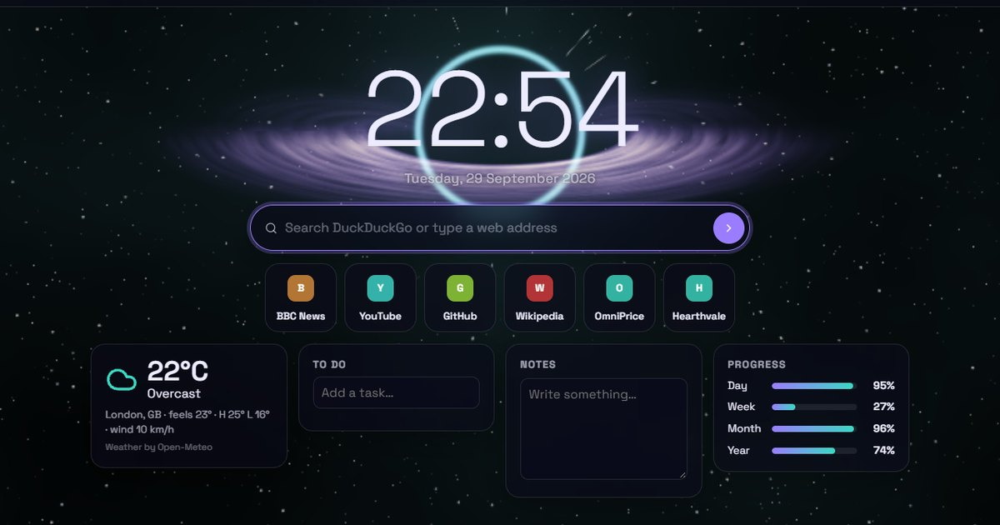
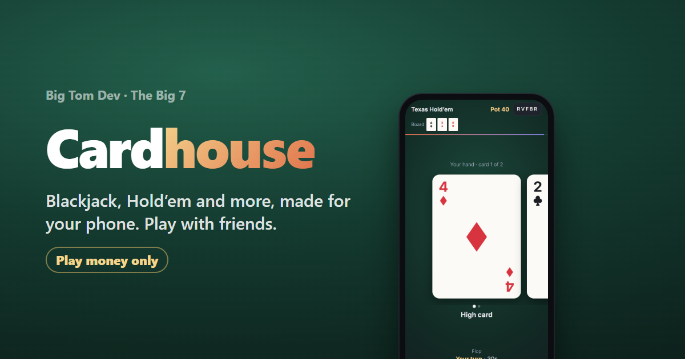

# Big Tom Dev

The code behind **[bigtomdev.fyi](https://bigtomdev.fyi)**: a small site that collects my bigger projects, and the apps that live on it.

The main collection is **[The Big 7](https://bigtomdev.fyi/the-big-7/)**: seven projects, built one at a time. Four are live.

| # | Project | What it is | Link |
|---|---|---|---|
| 01 | **Hearthvale** | Your Discord server as a cosy voxel world you can walk around in | [bigtomdev.fyi/hearthvale](https://bigtomdev.fyi/hearthvale/) |
| 02 | **OmniPrice** | Track and compare the price of everything, from eggs to oil to wages | [bigtomdev.fyi/omniprice](https://bigtomdev.fyi/omniprice/) |
| 03 | **Homebase** | A private, animated browser start page | [bigtomdev.fyi/homebase](https://bigtomdev.fyi/homebase/) |
| 04 | **Cardhouse** | Online card games made for your phone | [bigtomdev.fyi/cardhouse](https://bigtomdev.fyi/cardhouse/) |
| 05–07 | Coming soon | Not revealed yet | |

## The apps

### 01 · Hearthvale



Log in with Discord, pick a server, and it becomes a world: categories are towns, text channels are houses, and voice channels are open-air gazebos. Step into a house to read and post real messages. Talk to nearby players with proximity voice. Build your own voxel character.

Built with three.js, a Fastify and WebSocket server, discord.js, SQLite and LiveKit.

### 02 · OmniPrice



Charts and comparisons for 140 price series: food, wages, energy, commodities, currencies, crypto, inflation and interest rates, from official and open sources (ONS, BLS, the ECB and others). Prices can be shown in any of 30 currencies.

Add up to five series to a comparison chart and share the link.

### 03 · Homebase



A start page for your browser with 16 animated themes (a black hole, the northern lights, city rain and more) and 20 widgets: weather, to-dos, notes, a focus timer, world clocks, markets and others. Every theme is customisable. There's no account, and everything you set up stays in your browser. Built-in guides show how to set it as your home page in each major browser.

### 04 · Cardhouse



A card room built for phones. Your hand fills the screen: swipe sideways through your cards, and swipe up for your chips, the table and the other players. Start a table, share a five-letter code, and play with friends. No account needed.

Games: Blackjack, Texas Hold'em, Five Card Draw, Three Card Poker and nine-card poker.

**Play money only.** Chips are free and worthless. They can't be bought, sold or cashed out.

## What's in this repository

| Folder | Contents |
|---|---|
| [`hearthvale/`](hearthvale/) | Everything that runs on bigtomdev.fyi. Despite the name, it holds all four apps, the site pages and the backend. |
| [`browser-home-page-original/`](browser-home-page-original/) | A copy of the start page that inspired Homebase, kept for reference. Homebase was rebuilt from scratch and shares no code with it. |
| `graphify-out/` | A generated knowledge graph of the codebase. Not needed to run anything. |

Inside `hearthvale/`:

| Path | Contents |
|---|---|
| `apps/hearthvale` | Hearthvale (the voxel world) |
| `apps/omniprice` | OmniPrice |
| `apps/homebase` | Homebase |
| `apps/cardhouse` | Cardhouse |
| `apps/server` | The backend: Hearthvale's API, real-time world and voice, plus Cardhouse's game server |
| `packages/shared` | Types and the world generator shared by Hearthvale's client and server |
| `packages/cards` | Cardhouse's rules engine: shuffling, hand ranking and each game's rules |
| `api/` | OmniPrice's data API, which runs as a Vercel Function |
| `site/` | The Big Tom Dev pages: home, The Big 7, Privacy, Terms and Cookies |
| `scripts/` | Build and maintenance scripts |
| `docs/` | Plans and notes |

Everything is plain TypeScript with Vite. There's no UI framework.

## Running it locally

You need Node.js 22 or newer.

```bash
cd hearthvale
npm install
```

| To run | Command | Then open |
|---|---|---|
| OmniPrice | `npm run dev:omniprice` | http://localhost:5174/omniprice/ |
| Homebase | `npm run dev:homebase` | http://localhost:5175/homebase/ |
| Hearthvale and the backend | `npm run dev` | http://localhost:5173/ |
| Cardhouse | `npm run dev`, then `npm run dev:cardhouse` in a second terminal | http://localhost:5176/cardhouse/ |

OmniPrice and Homebase run on their own with no setup. Hearthvale and Cardhouse need the backend, which needs a Discord application and a `.env` file. The [Hearthvale README](hearthvale/README.md) walks through that setup.

Checks:

```bash
npm run typecheck
npm test
```

## How it's hosted

- **The site and apps** are static files on Vercel, built by `npm run build:vercel`. OmniPrice's data API runs there too, as a Vercel Function.
- **The backend** runs on a home machine and is reached at `api.bigtomdev.fyi` through a Cloudflare Tunnel.
- **Voice** in Hearthvale uses LiveKit Cloud.

Full deployment steps, environment variables and architecture notes are in the [Hearthvale README](hearthvale/README.md).

## Privacy and legal

There are no ads, no analytics and no tracking cookies anywhere on the site. The details are in the [Privacy Policy](https://bigtomdev.fyi/privacy/), [Terms](https://bigtomdev.fyi/terms/) and [Cookie Policy](https://bigtomdev.fyi/cookies/).

The code, art and design belong to Big Tom Dev. Data shown in OmniPrice belongs to its providers, who are credited in the app. Game names and trademarks belong to their owners, who don't sponsor or endorse this site.

Want to try Hearthvale? [Join the dev server on Discord](https://discord.gg/GSwZqXPyf2).
